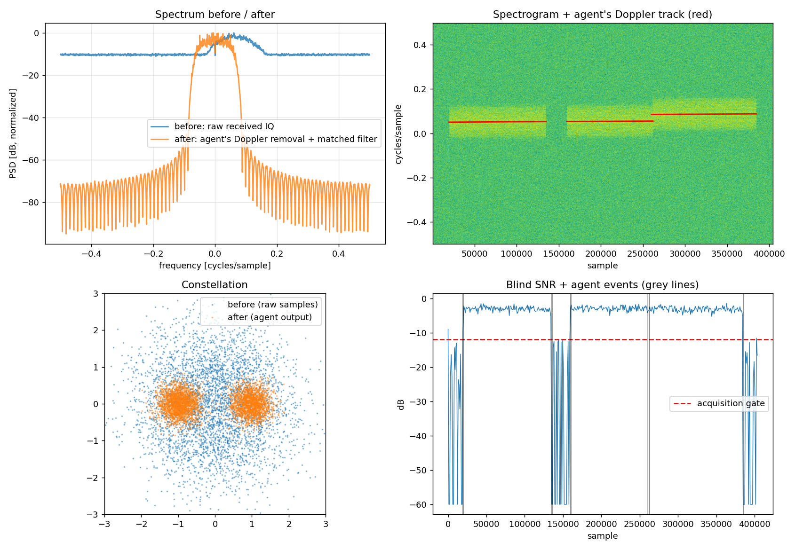
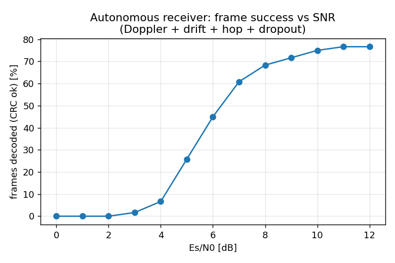

# Deep-Space Link Agent — Track 1 (Matlab in Space Hackathon)

An autonomous receiver that finds a weak, drifting BPSK telemetry signal in noise,
tracks Doppler, survives dropouts and frequency hops, and outputs decoded,
CRC-checked spacecraft telemetry — with no manual tuning.

## Problem and approach
_TODO: expand._ Pipeline: blind SNR activity detection → Doppler estimation
(squaring + FFT) with hop detection and drift fit → RRC matched filter + AGC →
Gardner timing recovery → Costas carrier loop with lock detector → CCSDS ASM
frame sync (resolves 180° ambiguity) → de-randomize → CRC-16 → telemetry log.

## Datasets
- Synthetic CCSDS-style telemetry frames through a simulated deep-space channel
  (Doppler + drift, hop, phase noise, clock drift, dropouts, AWGN).
- RadioML 2016.10A and/or 2018.01A (DeepSig, CC BY-NC-SA 4.0): modulation classification stage.
  O'Shea & West, "Radio Machine Learning Dataset Generation with GNU Radio", GRCon 2016.
- SatNOGS Network observations (Libre Space Foundation, CC BY-SA 4.0): real satellite pass recordings. _TODO: list observation IDs._

## How to run
**Python scripts (main):**
```bash
pip install -r requirements.txt
# put RML2016.10a_dict.pkl in data/ first
python train_classifier.py                 # trains on RadioML -> models/classifier_features.joblib
python train_classifier.py --model cnn     # optional CNN (needs PyTorch)
python train_classifier.py --dataset 2018 --per-pair 200   # RadioML 2018.01A subset (needs h5py)
python run_demo.py                         # receiver agent, uses the trained classifier automatically
python decode_satnogs.py data/satnogs/<observation>.ogg --reference data/satnogs/<frames>.txt   # real pass
```

**Notebooks:**
- `deepspace_link_full_pipeline.ipynb` (**main**): RadioML data → train classifier → simulated pass → agent → telemetry + all plots. Set `DATASET = "2016"` or `"2018"` in the first cell, put the file in `data/`, then Run All.
- `03_satnogs_real_data.ipynb`: decodes a **real SatNOGS satellite pass** (AFSK 1200 / AX.25 audio) and compares with SatNOGS' own decoder.
- `deepspace_link_track1.ipynb`: quick receiver-only demo, no data needed.

**Other options:**
```bash
python run_demo.py              # one pass, writes results/telemetry_log.csv + overview.png
python run_demo.py --esn0 5     # harder
python run_demo.py --sweep      # frame success vs Es/N0
```

## Results



## Limitations and next steps
_TODO_
